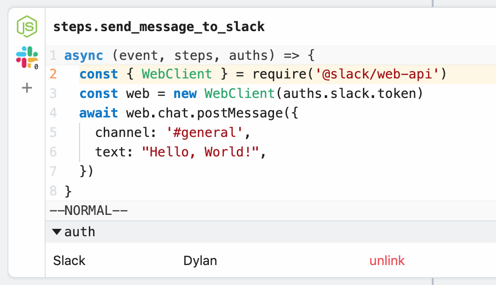

# Connected Accounts

Pipedream allows you to connect accounts from various apps and services within our UI. Once you connect an account, you can link that account to specific code or action steps in a workflow and use the OAuth access tokens, API key, or other auth info to make API requests to the desired service.

For example, you can connect your Slack account to a code step, then send a message using the OAuth access token Pipedream generates on your behalf:

We'll review how all of this works below.

[[toc]]

## Supported Apps

Pipedream supports tens of apps and will be adding hundreds more over the coming months. The easiest way to see if we support a specific account is to try [connecting that account](#connecting-your-accounts).

If we don't support a service you need to connect to, please [reach out](/support/) and let us know.

## Connecting your accounts

### From your Apps screen

### From a code step or action

## Types of Integrations

### OAuth

For services that support OAuth, Pipedream operates an OAuth application that mediates access to the service so you don't have to maintain your own app, store refresh and access tokens, and more.

When you connect an account, you'll see a new window open where you authorize the Pipedream application to access data in your account. Pipedream stores the OAuth refresh token tied to your authorization grant, generating access tokens you can use to authorized requests to the service's API.

## Key-based

We also support services that authorize requests via API key or other long-lived tokens. For those services, you'll have to create your keys in the service itself, then add them to your connected accounts in Pipedream.

For example, if you add a new connected account for **Sendgrid**, you'll be asked to add your Sendgrid API key the following form:

When you connect this Sendgrid account to a step, your API key will be available for use in the variable `auths.sendgrid.api_key_id`.

## Requesting a new app or service

If we don't support a service you need to connect to, please [reach out](/support/) and let us know.

<Footer />
