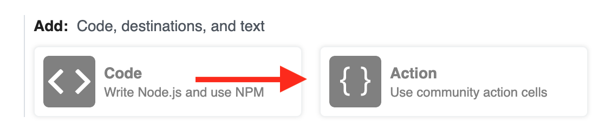

# Destinations

**Destinations**, like [Actions](/notebook/actions/), abstract the delivery and connection logic required to send events to services like Amazon S3, or targets like HTTP and email.

However, Destinations are different than Actions in two ways:

- **Events are delivered to the Destinations asynchronously**, after your workflow completes. This means you don't wait for network I/O (e.g. for HTTP requests or connection overhead for data warehouses) within your workflow code, so you can process more events faster.
- In the case of data stores like S3 and warehouses like Snowflake, you typically don't want to send every event on its own. This can be costly and confers little benefit. **Instead, you typically want to batch a collection of events together, sending the batch at some frequency. Destinations handle that batching for relevant services**.

The docs below discuss features common to all Destinations. See the [docs for a given destination](#available-destinations) for information specific to those destinations.

[[toc]]

## Available Destinations

- [Webhook](/notebook/destinations/http/)
- [Email](/notebook/destinations/email/)
- [S3](/notebook/destinations/s3/)
- [Pipedream Data Warehouse](/notebook/sql/)
- [Snowflake](/notebook/destinations/snowflake/)
- [SSE](/notebook/destinations/sse/)

## Adding a Destination

### Adding a Destination using Actions

The simplest way to send data to a Destination is using one of our pre-built [Actions](/notebook/actions/). Just add the relevant Action, enter the required values, and send data to your workflow!

For example, you can use the [Webhook Action](/notebook/destinations/http/) to send an HTTP request from a workflow. First, add a new Action to your workflow:

<div>

</div>

Choose the **Webhook** action:

<div>

</div>

and add the **URL** and **Payload**. Here, we add a [RequestBin](https://requestbin.com) URL send the original source payload — `$event.body` — to this URL:

<div>

</div>

This action defaults to sending an HTTP `POST` request with the desired payload to the specified URL. If you'd like to change the HTTP method, add Basic auth, query string parameters or headers, you can click the sections below the Payload field.

### Using `$send`

You can send data to Destinations in [Node.js code steps](/notebook/code/), too, using `$send` functions.

`$send` is an object provided by Pipedream that exposes destination-specific functions like `$send.http()`, `$send.s3()`, and more. **This allows you to send data to destinations programmatically, if you need more control than Actions afford**.

Let's use `$send.http()` to send an HTTP POST request like we did in the Action example above. First, add a Code step to your workflow:

<div>

</div>

[Create an endpoint URL on RequestBin](https://requestbin.com), adding the code below to your code step, with the URL you created:

```javascript
$send.http({
  method: "POST",
  url: "[YOUR URL HERE]",
  data: {
    name: "Luke Skywalker"
  }
});
```

See the docs for the [Webhook destination](/notebook/destinations/http/) to learn more about all the options you can pass to the `$send.http()` function.

Again, it's important to remember that **Destination delivery is asynchronous**. If you iterate over an array of values and send an HTTP request for each:

```javascript
const names = ["Luke", "Han", "Leia", "Obi Wan"];
names.forEach(name => {
  $send.http({
    method: "POST",
    url: "[YOUR URL HERE]",
    data: {
      name
    }
  });
});
```

you won't have to `await` the execution of the HTTP requests in your workflow. We'll collect every `$send.http()` call and defer those HTTP requests, sending them after your workflow finishes.

## Asynchronous Delivery

For every event sent to a workflow, for each Destination you've added, we send the specified payload to the desired Destination.

Events are delivered to Destinations _asynchronously_ — that is, separate from the execution of your workflow. **This means you're not waiting for network or connection I/O in the middle of your function, which can be costly**.

Some Destination payloads, like HTTP, are delivered within seconds. For other Destinations, like S3 and SQL, we collect individual events into a batch and send the batch to the Destination. See the [docs for a given Destination](#available-destinations) for the relevant batch delivery frequency.

## Payload Expressions

The **Payload** field lets you specify what data gets sent to the corresponding destination.

Generally, you'll want to send some portion of the data in [`$event`](/notebook/dollar-event/). For example, if you wanted to send the full `$event` — all the data included in the original payload, HTTP headers, and more — you'd enter `$event` in the **Payload** field:

<div>

</div>

If you wanted to send only the body of the request, you'd enter `$event.body`

<div>

</div>

If you added a new property to `$event` in a code cell and want to send just that to your destination — for example, `emailEnrichmentData` — you'd enter that:

<div>

</div>

**You can also enter any valid [JavaScript expression](https://developer.mozilla.org/en-US/docs/Web/JavaScript/Guide/Expressions_and_Operators#Expressions) in the Payload field** — that is, anything that returns a value.

**Moreover, any expression that returns `undefined` tells Pipedream that no data should be sent to the destination for this event**.

When used in combination, **these two features allow you to conditionally send data to destinations**. For example, let's say you'd like to save only a sample of events in an S3 bucket. First, you should add a code cell that marks a given event as in the sample, or not, based on your sample logic. For example:

```javascript
$event.sampleRate = 0.5;
$event.inSample = Math.random() > $event.sampleRate;
```

The code above will assign 50% of events to the sample (`inSample` is `true`); the other 50% will _not_ be assigned to the sample.

Then, in an S3 destination, specify `$event.inSample === true ? $event : undefined` as the payload expression:

<div>

</div>

This code uses JavaScript's [ternary operator](https://developer.mozilla.org/en-US/docs/Web/JavaScript/Reference/Operators/Conditional_Operator), and tells Pipedream: when the `inSample` flag is set to `true`, send the full `$event` to the destination. Otherwise, send `undefined`, which tells Pipedream not to send anything at all.

Altogether, this has the effect of sending a random sample of 50% of events to the S3 bucket you specify.

</Footer>
