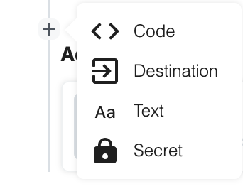

# Destinations

Destination cells allow you to quickly send the data from your pipeline to destinations outside of Pipedream — for example, [HTTP](/notebook/destinations/http/) and [S3](/notebook/destinations/s3/) — as well as the [Pipedream SQL service](/notebook/sql/), a Pipedream-managed data warehouse.

Typically, sending data to these destinations requires a lot of code to manage error conditions and retries. With destination cells, Pipedream handles that for you. You only need to specify what data gets sent, and where to send it.

You can add multiple Destination cells within a single notebook, for example to send data to multiple S3 buckets. Destinations can be added at any step of your notebook.

**The docs below discuss the features common to all destinations. See the docs on [HTTP](/notebook/destinations/http/), [S3](/notebook/destinations/s3/), and [SQL](/notebook/sql/) for information specific to those destinations.**

[[toc]]

## Adding a new Destination

You can add a new **Destination** cell in one of two ways.

First, you can click on the **+** button under any existing cell, and choose the **Destination** cell type:

<div>

</div>

On a new notebook, you'll also see a larger button to quickly add a destination:

<div>

</div>

After selecting the **Destination** cell type, you'll be asked to choose your destination type:

<div>

</div>

Note that your list of destinations may look different than the screenshot above. We're constantly adding new destinations to help you route data to wherever you'd like. If we don't support your target destination, please [reach out](/support/) so we can discuss it more!

## Destination Delivery

For every event sent to a pipeline, for each destination cell in your notebook, we send the value of the **Payload** expression to the desired destination.

Events are delivered to destinations _asynchronously_ — that is, separate from the execution of your pipeline.

Some destination payloads are delivered within seconds, for every event sent to your pipeline. This is the case for HTTP destinations. For other destinations, like S3 and SQL, we collect individual events into a batch and send the batch to the destination. See the docs for your specific destination for the specific batch delivery frequency.

## Destination Parameters

Every destination requires you specify details about where to deliver data, and what data to deliver. Collectively, we refer to these details as **destination parameters**.

Destination parameters are specific to each destination. For example, HTTP destinations require you specify the HTTP endpoint URL to send data to; S3 destinations require an S3 bucket name. Please consult the docs for your specific destination to see the parameters required for that destination.

## Payload Expressions

The **Payload** field lets you specify what data gets sent to the corresponding destination.

Generally, you'll want to send some portion of the data in [`$event`](/notebook/dollar-event/). For example, if you wanted to send the full `$event` — all the data included in the original payload, HTTP headers, and more — you'd enter `$event` in the **Payload** field:

<div>

</div>

If you wanted to send only the body of the request, you'd enter `$event.body`

<div>

</div>

If you added a new property to `$event` in a code cell and want to send just that to your destination — for example, `emailEnrichmentData` — you'd enter that:

<div>

</div>

**You can also enter any valid [JavaScript expression](https://developer.mozilla.org/en-US/docs/Web/JavaScript/Guide/Expressions_and_Operators#Expressions) in the Payload field** — that is, anything that returns a value.

**Moreover, any expression that returns `undefined` tells Pipedream that no data should be sent to the destination for this event**.

When used in combination, **these two features allow you to conditionally send data to destinations**. For example, let's say you'd like to save only a sample of events in an S3 bucket. First, you should add a code cell that marks a given event as in the sample, or not, based on your sample logic. For example:

```javascript
$event.sampleRate = 0.5;
$event.inSample = Math.random() > $event.sampleRate;
```

The code above will assign 50% of events to the sample (`inSample` is `true`); the other 50% will _not_ be assigned to the sample.

Then, in an S3 destination, specify `$event.inSample === true ? $event : undefined` as the payload expression:

<div>

</div>

This code uses JavaScript's [ternary operator](https://developer.mozilla.org/en-US/docs/Web/JavaScript/Reference/Operators/Conditional_Operator), and tells Pipedream: when the `inSample` flag is set to `true`, send the full `$event` to the destination. Otherwise, send `undefined`, which tells us not to send anything at all.

Altogether, this has the effect of sending a random sample of 50% of events to the S3 bucket you specify.

## Still have questions?

Please [reach out](/support/) if this doc didn't answer your question. We're happy to help!
