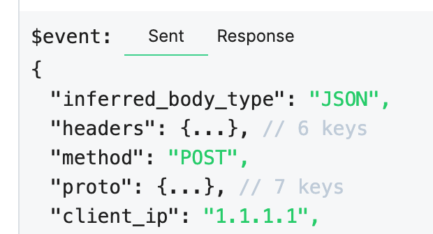
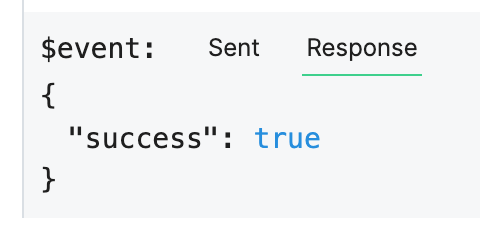

# Webhook (HTTP) Destinations

Webhook destinations allow you to send data to another HTTP endpoint URL outside of Pipedream. This can be an endpoint you own and operate, or a URL tied to a service you use (for example, a [Slack Incoming Webhook](https://api.slack.com/incoming-webhooks)).

[[toc]]

## Adding a Webhook Destination

First, [add a new Destination cell](/notebook/destinations/#adding-a-new-destination), then choose the **Webhook** destination:

Webhook destinations require you to specify the **Endpoint** where you want to send data, and the **Payload** you want to send:

See the [docs on payload expressions](/notebook/destinations/#payload-expressions) to learn more about what you can specify in the **Payload** field.

## Webhook destination delivery

Webhook destination delivery is handled asynchronously, separate from the execution of a pipeline. However, we deliver the specified payload to Webhook destinations for every event sent to your pipeline.

Generally, this means it should only take a few seconds for us to send the event to the destination you specify. In some cases, delivery will take longer. You can always review how many destinations we've delivered a given event to by examining the [**Dest** column in the Inspector](/notebook/inspector/#dest-destinations).

We'll show you the specific payload we delivered for that event under the **Sent** column of the destination:

## HTTP Responses

We display the payload of the HTTP response issued by your endpoint in the **Response** tab of the destination observation:

## Retries

Currently, Pipedream will not retry any failed request. If your HTTP destination endpoint is down, or returns an error response, we'll display that response in the **Responses** tab associated with the destination.

## Acceptable Use

Do not use Pipedream to send HTTP requests to a service you do not own or operate. We take abuse of the service seriously and will terminate pipelines or accounts found to be in violation of our [Acceptable Use policy](https://pipedream.com/terms#b-acceptable-use). If you have any questions about this policy or anything else, please [reach out](/support/).
