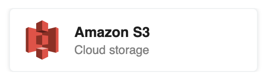
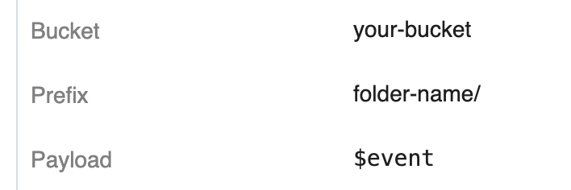

# Amazon S3 Destinations

[Amazon S3](https://aws.amazon.com/s3/) — the Simple Storage Service — is a common place to dump data for long-term storage on AWS. Pipedream supports delivery to S3 as a first-class destination in a notebook.

[[toc]]

## Adding an S3 Destination

First, [add a new Destination cell](/notebook/destinations/#adding-a-new-destination), then choose the **S3** destination:

<div>

</div>

S3 destinations require you to specify the **Bucket** where you want to send data, the **Payload** you want to send, and an optional [**Prefix**](https://docs.aws.amazon.com/AmazonS3/latest/user-guide/using-folders.html):

<div>

</div>

**You must allow Pipedream to upload objects to your bucket** — see the [S3 Bucket Policy](#s3-bucket-policy) below.

See the [docs on payload expressions](/notebook/destinations/#payload-expressions) to learn more about what you can specify in the **Payload** field.

## S3 Bucket Policy

In order for us to deliver objects to your S3 bucket, you need to modify the [bucket policy](https://docs.aws.amazon.com/AmazonS3/latest/user-guide/add-bucket-policy.html) for your target bucket to allow Pipedream to upload objects.

**Replace `[your bucket name]` with the name of your bucket** near the bottom of the policy.

```json
{
  "Version": "2012-10-17",
  "Id": "allow-pipedream-limited-access",
  "Statement": [
    {
      "Effect": "Allow",
      "Principal": {
        "AWS": "arn:aws:iam::203863770927:role/Pipedream"
      },
      "Action": [
        "s3:AbortMultipartUpload",
        "s3:GetBucketLocation",
        "s3:PutObject",
        "s3:PutObjectAcl",
        "s3:ListBucketMultipartUploads"
      ],
      "Resource": [
        "arn:aws:s3:::[your bucket name]",
        "arn:aws:s3:::[your bucket name]/*"
      ]
    }
  ]
}
```

This bucket policy provides the minimum set of permissions necessary for Pipedream to deliver objects to your S3 bucket. We use the [Multipart Upload API](https://docs.aws.amazon.com/AmazonS3/latest/dev/uploadobjusingmpu.html) to upload objects to S3, and need the [necessary permissions](https://docs.aws.amazon.com/AmazonS3/latest/dev/mpuAndPermissions.html).

## S3 destination delivery

S3 destination delivery is handled asynchronously, separate from the execution of a pipeline. **Moreover, events sent to an S3 bucket are batched and delivered once a minute**. For example, if you sent 30 events to an S3 destination within a particular minute, we would collect all 30 events, delimit them with newlines, and write them to a single S3 object.

In some cases, delivery will take longer than a minute. You can always review how many destinations we've delivered a given event to by examining the [**Dest** column in the Inspector](/notebook/inspector/#dest-destinations).

We'll show you the specific payload we delivered for that event under the **Sent** column of the destination:

<div>

</div>

## S3 object format

We upload objects to S3 using the following format:

```
[PREFIX]/YYYY/MM/DD/HH/YYYY-MM-DD-HH-MM-SS-IDENTIFIER.gz
```

That is — we write objects first to your prefix, then within folders specific to the current date and hour, then upload the object with the same date information in the object, so that it's easy to tell when it was uploaded by object name alone.

For example, if I were writing data to a prefix of `test/`, I might see an object in S3 at this path:

```
test/2019/05/25/16/2019-05-25-16-14-58-8f25b54462bf6eeac3ee8bde512b6c59654c454356e808167a01c43ebe4ee919.gz
```

As noted above, a given object contains all payloads delivered to an S3 destination within a specific minute. Multiple events within a given object are newline-delimited.

<Footer />
