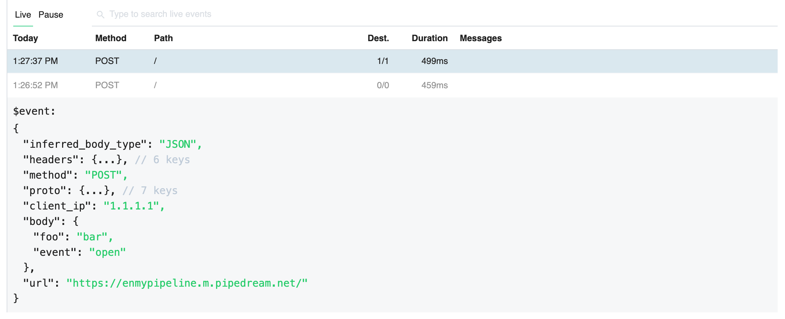

# Inspector

The Inspector gives you visibility to the events sent to a [source](/notebook/sources). Each source has an inspector attached to it, listing these events for inspection:

Clicking on an event from the list shows the event data ([`$event`](/notebook/dollar-event/)) in the inspector, as well as the entire execution details of the pipeline for that event.

Let's review each of the Inspector's components and fields below.

[[toc]]

## Live / Pause

The **Live** and **Pause** labels near the top of the inspector are clickable. Toggling your inspector to **Live** lists events in the inspector as they are sent to your source. Events should appear in real-time; you shouldn't have to refresh the page to see them. This is the default mode.

Clicking **Pause** pauses the stream of events in the UI. **Events sent to a source are still sent through the pipeline, but they do not show up in the inspector** while you're in a paused state.

While paused, we show the number of events received by your source:

Clicking **Live** should immediately list the events that came in while the inspector was paused.

## Search

To the right of **Live / Pause**, we've provided a search box you can use to filter the list of events:

Here are a few things to note about searches:

- Search is case-insensitive. Both "post" and "POST" should match queries sent using the HTTP `POST` method, for example.
- We perform partial string matches on the text you're searching for. "test" will match events with "test" and "testing" in the body.
- We searche through all field names and values in the event. For example, you can search for text in the HTTP method, path, body and more.

## Columns in the event list

We display the most useful properties of source data as columns in the Inspector:

### Date / Time

We show the date and time the event was received by the source in the left-most column of the inspector. We also group events by day, and refer to the dates by relative time, for example:

### Method

For **Webhook** sources, the [HTTP method](https://requestbin.com/blog/working-with-webhooks/#http-methods-get-and-post) tied to the original HTTP request, like `GET` and `POST`.

### Path

For **Webhook** sources, the [path](https://requestbin.com/blog/working-with-webhooks/#url-path) tied to the URL of the HTTP request, for example the `/wiki/Webhook` part of the URL `https://en.wikipedia.org/wiki/Webhook`.

### Dest. (Destinations)

If you've configured any [destinations](/notebook/destinations/), the **Dest** field shows the number of destinations we successfully delivered the event to, over the number of destinations you've configured for this pipeline.

For example, if you've added one destination and your event was successfully delivered, you'll see `1/1` in this field:

If you added _two_ destinations and the pipeline failed to deliver an event to one (e.g. it was an HTTP destination that responded with a 500 status code), we'll show `1/2` here. You can see either destination response in the observability associated with the destinations below — see the [destinations](/notebook/destinations/) docs for more details.

We batch the events sent to some destinations, like S3 and [SQL](/notebook/sql/), sending the events received within a particular minute as a group, once a minute. You may see situations where we've delivered your event to `0/2` destinations, but if you wait a minute, we should update this state once the events have been delivered.

All of the data in these columns are also accessible in `$event`, so that you can program your pipeline based on the values of these fields.

## Duration

The **Duration** field shows the time it took to run your code, in addition to the time it took Pipedream to handle the execution of that code and manage its output.

Specifically,

**Duration = Time Your Code Ran + Pipedream Execution Time**

Destination delivery is handled asynchonously, after your code is run. The **Duration** here is tied to the runtime of your code. Separately, you can see the [destination runtime](/notebook/destinations/#destination-delivery) in the destination cells themselves.

## Messages

Any `console.log()` statements or other code output is attached to the associated code cells. But events like [`$end()` messages](/notebook/code/#end) or [exceptions](/notebook/code/#exceptions) end a pipeline's execution, and so are worth displaying prominently:

## `$event`

When you send an event to the pipeline, we take the source data — for example, the HTTP payload, headers, etc. — and add our own Pipedream metadata to it. The resulting data is exposed as a JavaScript object named `$event`.

When you click on a given event in the inspector, we show you the contents of `$event`.

## Events from older versions your pipeline

## Still have questions?

Please [reach out](/support/) if this doc didn't answer your question. We're happy to help!
