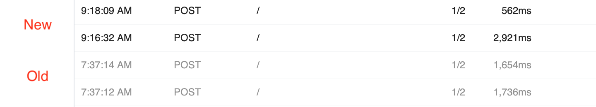

# Inspector

The Inspector lists the events you send to a [source](/notebook/sources/). Once you choose a source and send events to it, you'll see those events in the Inspector, to the left of your workflow:

Clicking on an event from the list shows the event data ([`$event`](/notebook/dollar-event/)) in the Inspector, as well as the logs and observability associated with the execution for that event.

Let's review each of the Inspector's components and fields below.

[[toc]]

## Test Events

We provide the ability for you to send a test event through your workflow to test it before running it on real data.

We provide a default test event you can send to a workflow that helps you explore the features of the product. Click the **Send Test Event** button at the top of the Inspector to send this event to your workflow:

**The contents of this test event varies depending on the source**.

When you're first learning how Pipedream works, you can trigger a workflow using this test event to learn how [code](/notebook/code/), [actions](/notebook/actions), [destinations](/notebook/destinations/), and more.

Typically, though, you're processing events of a different shape in real workflows. **So we give you a way to edit the test event tied to a workflow**.

First, click the **Edit Test Event** button:

This will open a text editor next to the Inspector that lets you edit the test event for this workflow. You can add any valid JSON here and **Save** it. The next time you click the **Send Test Event** button, your new test event will be sent through your workflow.

Clicking the **Default** button in the **Edit Test Event** editor will revert your test event back to the original default. You'll have to **Save** this change, as well.

## Replay Event

Any events you've previously sent to a workflow, you can replay through your workflow, sending the same event again. Once you select an event in the Inspector, you'll see an icon at the far right of the row:

Clicking on that icon replays the event.

The contents of [`$event`](/notebook/dollar-event/) will be the same for the replayed event. The contents of [`$context`](/notebook/dollar-context/), however, will contain a different event `id` and `ts`, to represent the fact that this is a different execution of the same event.

## Live / Pause

The **Live** and **Pause** labels near the top of the Inspector are clickable. Toggling your inspector to **Live** lists events as they are sent to your source. Events should appear in real-time; you shouldn't have to refresh the page to see them. This is the default mode.

Clicking **Pause** pauses the stream of events in the UI. **Events sent to a source still invoke your workflow, but they do not show up in the Inspector** while you're in a paused state.

While paused, we show the number of events received by your source:

Clicking **Live** should immediately list the events that arrived while the Inspector was paused.

## Search

To the right of the **Live / Pause** toggle, we've provided a search box you can use to filter the list of events:

Here are a few things to note about searches:

- Search is case-insensitive. Both "post" and "POST" should match queries sent using the HTTP `POST` method, for example.
- We perform partial string matches on the text you're searching for. "test" will match events with "test" and "testing" in the body.
- We search through all field names and values in the event. For example, you can search for text in the HTTP method, path, body and more.

## Columns in the event list

We display the most useful properties of source data as columns in the Inspector:

### Date / Time

We show the date and time the event was received by the source in the left-most column of the inspector. We also group events by day, and refer to the dates by relative time, for example:

## Duration

The **Duration** field shows the time it took to run your code, in addition to the time it took Pipedream to handle the execution of that code and manage its output.

Specifically,

**Duration = Time Your Code Ran + Pipedream Execution Time**

Destination delivery is handled asynchonously, after your code is run. The **Duration** here is tied to the runtime of your code. Separately, you can see the [destination runtime](/notebook/destinations/#asynchronous-delivery) in the destination cells themselves.

## Messages

Any `console.log()` statements or other output of code steps is attached to the associated code cells. But [`$end()`](/notebook/code/#end) or [exceptions](/notebook/code/#exceptions) end a workflow's execution, so their details are worth displaying prominently:

## `$event`

When you send an event to your workflow, we take the source data — for example, the HTTP payload, headers, etc. — and add our own Pipedream metadata to it. That collection of data is exposed as a JavaScript object named [`$event`](/notebook/dollar-event/) you can use in the rest of your workflow.

When you click on a given event in the Inspector, we show you the contents the associated `$event` variable:

You can read and modify `$event` in any [code](/notebook/code/) step, or reference it in [actions](/notebook/actions/). See those docs or the general [docs on `$event`](/notebook/dollar-event/) for more information.

## Events from older versions your workflow

When you modify and save your workflow, we increment its version:

Events sent to the newest version of your workflow appear in black in the Inspector. Events from older versions appear in grey:

When you select events from older versions of your workflow, note that we display the workflow and all associated observability at that point in time. So if an older version of your workflow had a code step, or an action, that you've subsequently removed, it will still appear with older events sent to that version.

<Footer />
