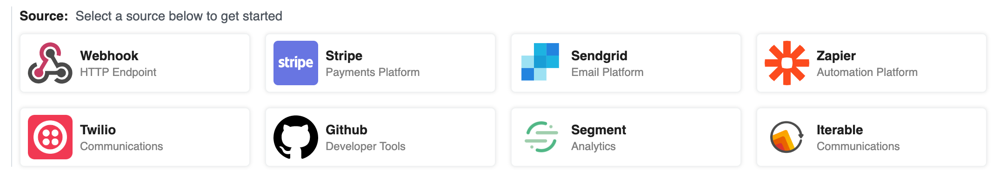

# Triggers

Workflows execute on every trigger event (e.g., HTTP requests or a schedule).

[[toc]]

## Webhook

When you select the **Webhook** trigger, we create a URL endpoint specific to your workflow.

While we call the trigger "Webhook", it's technically a general HTTP trigger. You can send any HTTP requests to this endpoint, from anywhere on the web. You can configure the endpoint as the destination URL for a webhook or send HTTP traffic from your application - we'll accept any [valid HTTP request](#valid-requests).

### Valid Requests

You can send a request to your endpoint using any valid HTTP method: `GET`, `POST`, `HEAD`, and more.

We default to generating HTTPS URLs in the UI for security, but will accept HTTP requests against the same endpoint URL.

Moreover, you can send data to any path on this host, with any query string parameters. We'll display the path in the [Inspector](/notebook/inspector/), and you can access the full URL in [`$event`](/notebook/dollar-event/) if you'd like to write code that interprets requests with different URLs differently.

You can find all of the HTTP request metadata associated with your event in the `event` object. Some common properties, like method, headers, URL and body, are included as top-level keys.

You can send data of any [Media Type](https://www.iana.org/assignments/media-types/media-types.xhtml) in the body of your request.

The primary limit we impose is on the size of the request body: we'll issue a `413 Payload Too Large` status when the body [exceeds our specified limit](#request-entity-too-large).

### How Pipedream handles JSON payloads

When you send JSON in the HTTP payload, or when JSON data is sent in the payload from a webhook provider, **Pipedream converts that JSON to its equivalent JavaScript object**. The trigger data can be referenced using the `steps` object.

### Cross-Origin HTTP Requests

We return the following headers on HTTP `OPTIONS` requests:

```
Access-Control-Allow-Origin: *
Access-Control-Allow-Methods: GET,HEAD,PUT,PATCH,POST,DELETE
```

Thus, your endpoint will accept [cross-origin HTTP requests](https://developer.mozilla.org/en-US/docs/Web/HTTP/CORS) from any domain, using any standard HTTP method.

### HTTP Responses

By default, when you send a [valid HTTP request](#valid-requests) to your endpoint URL, you should expect to receive a `200 OK` status code.

This is a convenient default for workflows. When you're processing HTTP requests, you often don't need to issue any special response to the client. We issue this default response so you don't have to write any code to do it yourself.

If you do need to issue a custom HTTP response from a workflow, **you can use the `$respond()` function in a Code or Action step**.

`$respond()` takes a single argument: an object with properties that specify the body, headers, and HTTP status code you'd like to respond with:

```javascript
$respond({
  status: 200,
  headers: { "my-custom-header": "value" },
  body: { message: "My custom response" } // This can be any string, object, or Buffer
});
```

**Additionally, for Pipedream to issue this response, one of the following must be sent in the HTTP request**:

- A `pipedream_response=1` query string parameter, e.g. a request must be made to `https://myendpoint.m.pipedream.net/?pipedream_response=1`, _or_
- An `x-pipedream-response` HTTP header with any value

**If the HTTP request does not contain at least one of these signals, the `$respond()` code in your workflow will not run**.

[This workflow](https://pipedream.com/@pravin/return-a-response-from-your-workflow-p_zACJqp/readme) contains example code and a `README` articulating how to use `$respond()`, as well.

### Errors

Occasionally, you may encounter errors when sending requests to your endpoint:

#### Request Entity Too Large

The endpoint will issue a `413 Payload Too Large` status code when the body of your request exceeds `{{$site.themeConfig.PAYLOAD_SIZE_LIMIT}}`.

In this case, the request will still appear in the inspector, with information on the error.

#### API key does not exist

Your API key is the host part of the endpoint, e.g. the `eniqtww30717` in `eniqtww30717.m.pipedream.net`. If you attempt to send a request to an endpoint that does not exist, we'll return a `404 Not Found` error.

We'll also issue a 404 response on workflows with a webhook source that have been [deactivated](/notebook/#deactivating-workflows).

#### Too Many Requests

If you send too many requests to your Webhook source within a small period of time, we may issue a `429 Too Many Requests` response. [Review our limits](/limits/) to understand the conditions where you might be throttled.

If you control the application sending requests, you should implement [a backoff strategy](https://medium.com/clover-platform-blog/conquering-api-rate-limiting-dcac5552714d) to temporarily slow the rate of events.

## Cron Scheduler Source

See [the cron docs](/cron/) for more information on how to use the **Cron Scheduler** trigger.

## Stripe, Sendgrid, and other SaaS triggers

You'll notice a range of other triggers available to choose from on new workflows:

<div>

</div>

These triggers all utilize webhooks for delivering new events to workflows, and operate in like a Webhook trigger in every way. But they help you better identify the true source of the events sent to a workflow. For example, the icon tied to the source is displayed on your list of workflows on the homepage.

If you don't see a source you'd like us to create, please [let us know](https://pipdream.com/community/).

<Footer />
