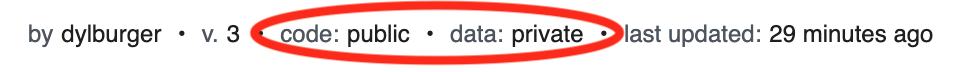

# Public Workflows, Private Data

**The workflows you create, and the steps within them, are public. The data you send to a workflow, or logs you generate, are private**.

As soon as you create and save a workflow, that code is publicly viewable on the internet. We believe everyone should benefit from others' workflows so they can solve the same problems without having to recreate that same workflow from scratch. In turn, [we'll run your workflows for free](/pricing/), within the [limits for the free tier](/limits/).

Because your code is public, **it's critical you do not save sensitive data — for example, API keys — in workflow steps**. You should save those values in [environment variables](/environment-variables/), and reference the value of that variable in your workflow, instead.

When making workflows public, the source or action steps are also public, **but the specific properties or [parameters](/notebook/destinations/#destination-parameters) of those steps are kept private**. For example, if you're using a Webhook source and sending data to S3 and SQL destinations, those steps will be public. But we won't reveal the specific HTTP URL associated with your Webhook source. And we won't reveal the name of the S3 bucket to which you're sending data.

You can always see the visibility status of a workflow and the associated data at the top of your workflow:

<Footer />
