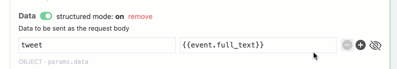
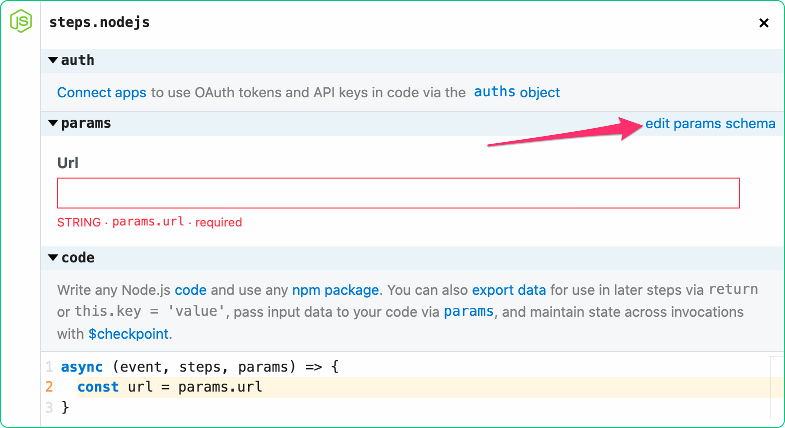
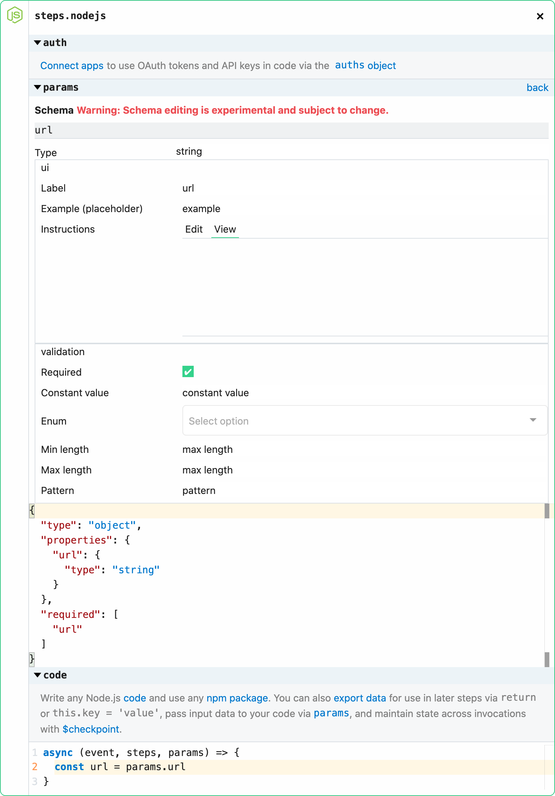

# Params


## What are params?

Params are form inputs that can be added to code steps in a workflow to abstract data from the code and improve reusability. Most actions use params to capture user input (e.g., to allow users to customize the URL, method and payload for the Send HTTP Request action). You can  reference objects in scope (e.g., `event`, `steps`, `process.env`) in params inputs to pass dynamic data to a step.


  * [Entering Expressions](#entering-expressions)
    + [Use the object explorer](#use-the-object-explorer)
    + [Paste a reference from a step export](#paste-a-reference-from-a-step-export)
    + [Manually enter or edit an expression](#manually-enter-or-edit-an-expression)
  * [Params Types](#params-types)
    + [Basic Params](#basic-params)
    + [Structured Params](#structured-params)
  * [Manage Params Visibility When Sharing](#sharing-params-values)
  * [Configuring Custom Params](#configuring-custom-params)
    + [Adding params to a code step](#adding-params-to-a-code-step)
    + [Configuring the params form](#configuring-the-params-form)

## Entering Expressions

Expressions make it easy to pass data exported from previous steps into a code step or action via params. For example, if your workflow is triggered on new Tweets and you want to send the Tweet content to an HTTP or webhook destination, you would reference <code>{{event.full_text}}</code> to do that.

While the data expected by each input depends on the data type (e.g., string, integer, array, etc) and the data entry mode (structured or non-structured — if applicable), the format for entering expressions is always the same; expressions are always enclosed in <code>{{...}}</code>.

There are three ways to enter expressions in a params form — you can use the object explorer, paste a reference from a step export, or enter it manually.

### Use the object explorer
When you click into a params input, an object explorer expands below the input. You can explore all the objects in scope, filter for keywords (e.g., a key name), and then select the element to insert into the form as an expression.


### Paste a reference from a step export

To paste a reference from a step export, find the reference you want to use, click **Copy Path** and then paste it into the input.


### Manually enter or edit an expression

To manually enter or edit an expression, just enter or edit a value between double curly braces <code>{{...}}</code>. Pipedream provides autocomplete support as soon as you type <code>{{</code>.


## Params Types

### Basic Params

Basic params support simple values or, expressions in <code>{{...}}</code>. You can enter expressions by copying the path from step observability, using the object explorer below the params input, or by manually entering a value within <code>{{...}}</code> (Pipedream provides autocomplete for the objects in scope, but you can also enter a value that is not supported by autocomplete).

| Type        | Structured                                                   |
| ----------- | ------------------------------------------------------------ |
| **String**  | This is the default type for newly added params. You can enter a simple value (e.g., `hello world`), an expression that evaluates to a string in <code>{{...}}</code> (e.g., <code>{{event.foo}}</code> or <code>{{JSON.stringify(event.object)}}</code>), or select a reference from the object explorer. You can also combine simple values and multiple expressions in the same input  (e.g., `hello world {{event.foo}}</code>). |
| **Number**  | You can enter a simple value (e.g., `123`), an expression that evaluates to a string in <code>{{...}}</code> (e.g., <code>{{event.foo}}</code> or <code>{{1+1}}</code>), or select a reference from the object explorer. |
| **Integer** | You can enter a simple value (e.g., `123`), an expression that evaluates to a string in <code>{{...}}</code> (e.g., <code>{{event.foo}}</code> or <code>{{1+1}}</code>), or select a reference from the object explorer. |


### Structured Params

Structured params provide a guided approach to enter values expected by a step. You can turn off structured mode at any time to enter an expression for the the param.


| Type        | Structured                                                   | Non-Structured                                               |
| ----------- | ------------------------------------------------------------ | ------------------------------------------------------------ |
| **Enum**    | Select a value from the drop down menu.                      | This is the default type for newly added params. You can enter a simple value (e.g., `hello world`), an expression that evaluates to a string in <code>{{...}}</code> (e.g., <code>{{event.foo}}</code> or <code>{{JSON.stringify(event.object)}}</code>), or select a reference from the object explorer. You can also combine simple values and multiple expressions in the same input  (e.g., `hello world {{event.foo}}</code>). |
| **Boolean** | Select a value from the drop down menu.                      | Enter an expression that evaluates to a boolean value in <code>{{...}}</code> (e.g., <code>{{event.foo}}</code> or <code>{{true}}</code>) |
| **Array**   | You can enter a simple value (e.g., `hello world`), an expression that evaluates to a string in <code>{{...}}</code> (e.g., <code>{{event.foo}}</code> or <code>{{JSON.stringify(event.object)}}</code>), or select a reference from the object explorer. You can also combine simple values and multiple expressions in the same input  (e.g., `hello world {{event.foo}}</code>). | Enter an expression that evaluates to an array in <code>{{...}}</code> (e.g., <code>{{event.foo}}</code> or <code>{{[1,2,3]}}</code>). |
| **Object**  | You can enter a simple value (e.g., `hello world`), an expression that evaluates to a string in <code>{{...}}</code> (e.g., <code>{{event.foo}}</code> or <code>{{JSON.stringify(event.object)}}</code>), or select a reference from the object explorer. You can also combine simple values and multiple expressions in the same input  (e.g., `hello world {{event.foo}}</code>). | Enter an expression that evaluates to an object in <code>{{...}}</code> (e.g., <code>{{event.foo}}</code> or <code>{{{“event”:”foo”}}}</code>). |

## Manage Params Visibility When Sharing

By default, any data you enter in a params form is private to workflow editors. If you are sharing a workflow and want specific values to be copied with the workflow then you should toggle the visibility for those params to **public** by clicking the "eye" icon at the far right. A common use case for this is to make params with expressions referencing earlier step exports public. Be sure not to make params public that contain sensitive data.



## Configuring Custom Params 

### Adding params to a code step

To add a params input to a code step, just use `params.<variable-name>` in your code. A form element will automatically be generated. E.g.,

```javascript
const url = params.url
```

Note: in some cases you may need to save your workflow for the form to generate.

### Configuring the params form

To configure the params form, click **edit params schema**.



You will be presented with option to customize the label, data type, description, required vs optional, and more.


